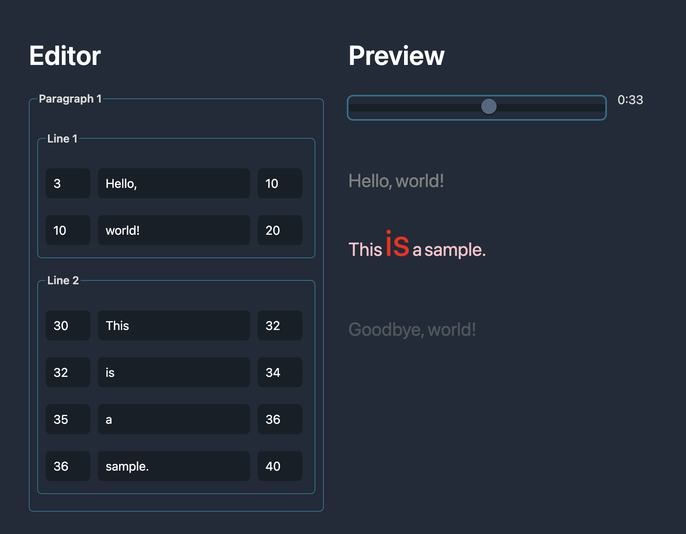

# @ioris/core

This package provides the core functionality for the [@ioris](https://www.npmjs.com/search?q=%40ioris) ecosystem for managing music lyrics with time synchronization.

## 🎵 Features

- **Time-synchronized lyrics**: Track current paragraph, line, word, and character based on playback time
- **Hierarchical data structure**: Lyric → Paragraph → Line → Word → Char
- **Functional API**: Modern, immutable, pure-function based approach
- **Immutable data structures**: Predictable, side-effect-free operations
- **TypeScript support**: Full type safety with comprehensive type definitions
- **Extensible**: Support for custom tokenizers and parsers

## 🚀 Quick Start

```typescript
import { createLyric, getCurrentWord, getCurrentSummary } from "@ioris/core";

// Create lyric data
const lyric = await createLyric({
  resourceID: "my-song",
  duration: 180.5,
  timelines: [[[
    { wordID: "1", text: "Hello", begin: 0, end: 1, hasWhitespace: true },
    { wordID: "2", text: "world!", begin: 1, end: 2 }
  ]]]
});

// Get current word at specific time
const currentWord = getCurrentWord(lyric, 0.5);
console.log(currentWord?.timeline.text); // "Hello"

// Get comprehensive summary
const summary = getCurrentSummary(lyric, 0.5);
console.log(summary.currentWord?.timeline.text); // "Hello"
```

## Example

`npm install && npm run dev`



## Plugins

- [@ioris/tokenizer-kuromoji](https://github.com/8beeeaaat/ioris_tokenizer_kuromoji)

- [@ioris/parser-ttml](https://github.com/8beeeaaat/ioris_parser_ttml)
