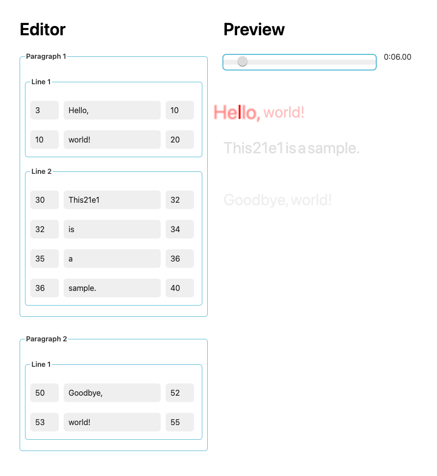

# @ioris/core

This package provides the core functionality for the [@ioris](https://www.npmjs.com/search?q=%40ioris) ecosystem for managing music lyrics.
For specific features and usage, please refer to the documentation of each module.

## Example

`npm install && npm run dev`

## Plugins

- [@ioris/tokenizer-kuromoji](https://github.com/8beeeaaat/ioris_tokenizer_kuromoji)

- [@ioris/parser-ttml](https://github.com/8beeeaaat/ioris_parser_ttml)
